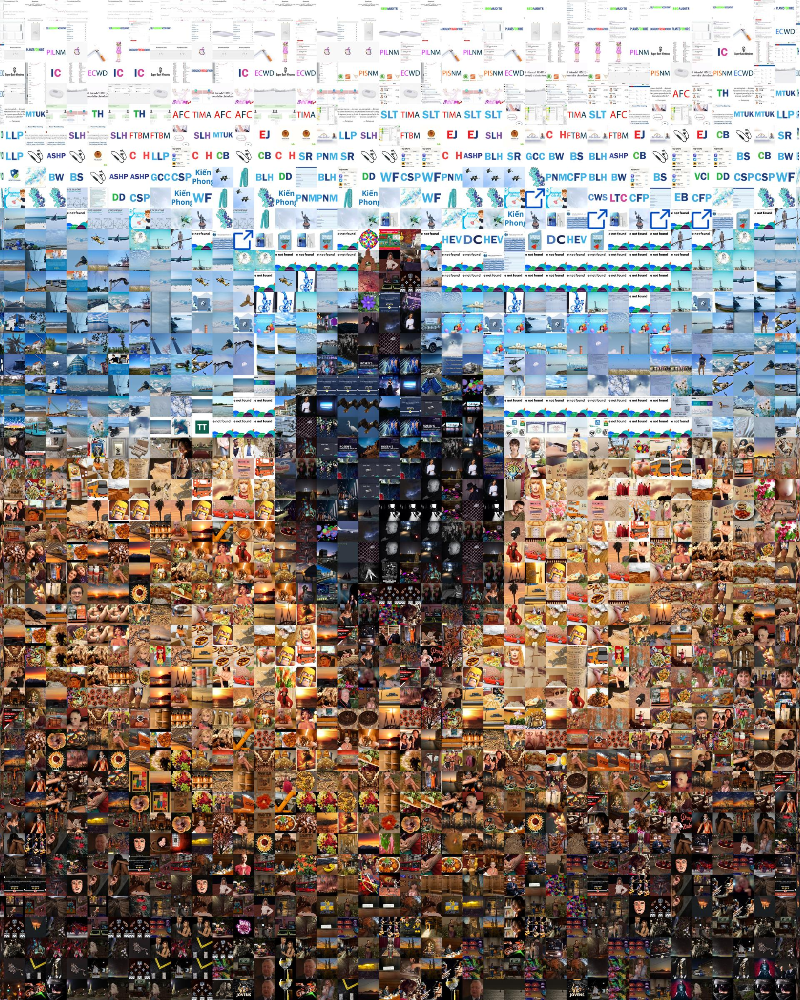
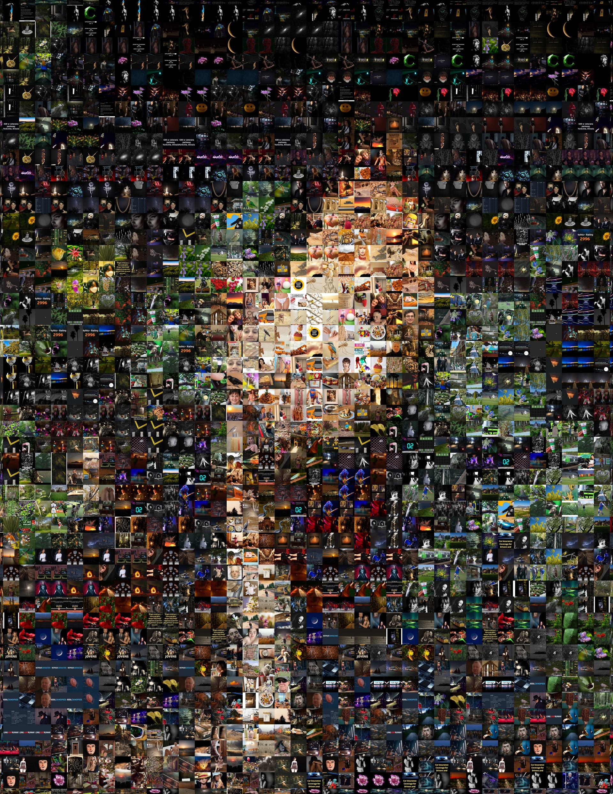
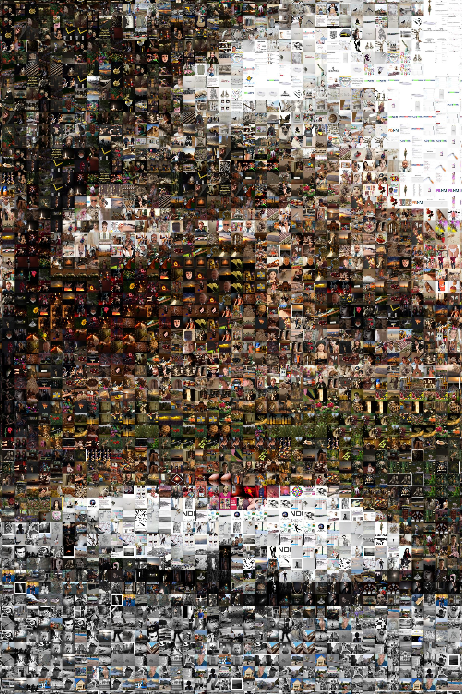

# Final Project - Photo Mosaics

## Methods

1. Downloading the corpus of images
  
    - Use Flickr APIs (`flickr.photos.getRecent`) to get a list of most recent 6000 images.
    - Iterate over the image, compute the average color of the image, i.e. get the mean of all pixels for red, green, and blue.

      In this process, only RGB images are kept, and grayscale images are discarded. Let `n` be the size of resulting image corpus.

      As a result, we have a `n-by-3` row vector (call it `colors`), each row representing the `[red green blue]` value of a source tile.

2. Divide the target image based on tile sizes

    Tiles are evenly divided. There are two cases:
      1. If `width` and `height` is divisible by `tile_size`, then there are `width / tile_size` columns and `height / tile_size` rows of tiles.

          

      2. If `width` or `height` is not divisible by `tile_size`, then some margins less than `tile_size` will be kept.

          

3. The algorithm for determining the match between source tiles and the target image.

    - For each division in process 2, I get its average color. And to get the tile with the best match, I compute the difference between `colors` row vector and the expected color, in the form of a row vector.

    - Then I obtain the Euclidean norm of each row using formula: 

    - Among all Euclidean norms, I find a smallest one and use the corresponding image for that tile.

4. Improvements:

    1. Randomness
        - I introduced the randomness by limiting the number of times that the same tile can appear.

          For my results, I'm using a hard limit of 5.

        - When finding the appropriate tile using the Euclidean norms, I get the five smallest ones and randomly pick one of them.

## Results

### Impact of Tile Sizes

Smaller tile size make the photo mosaic more realistically resembles the target image, but meanwhile loses some artistic effects. Larger tile size does the exact opposite.

| | |
:-------------------------:|:-------------------------:
Target Image | Tile Size 75
  |  
Tile Size 50 | Tile Size 25
  |  

### All 5 Images

Target Image             |  Mosaic
:-------------------------:|:-------------------------:
  |  
  |  
  |  
  |  
  |  

## Sources

| image | source |
| ----- | ------ |
| man.jpg | https://unsplash.com/photos/6VPEOdpFNAs |
| car.jpg | https://unsplash.com/photos/F3_14hBrG1Y |
| mountain.jpg | https://unsplash.com/photos/9X7v20kF3BM |
| pingpong.jpg | https://unsplash.com/photos/TEshgxpJylk |
| cat.jpg | https://unsplash.com/photos/Kgx8n2fea1w |
